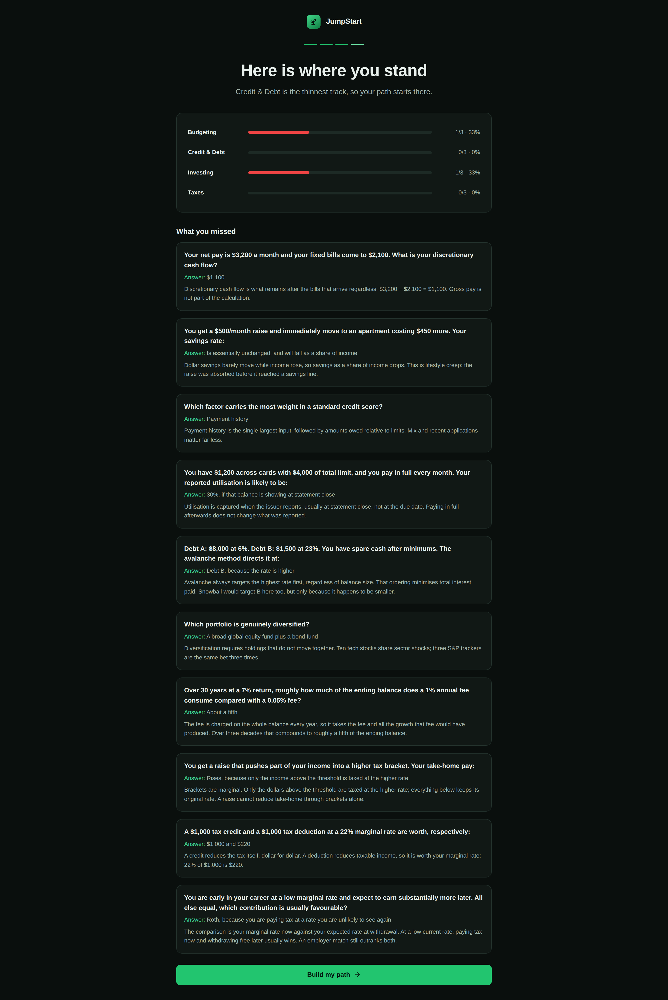
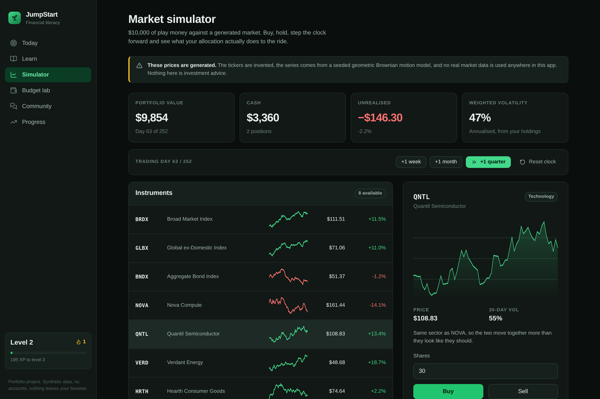
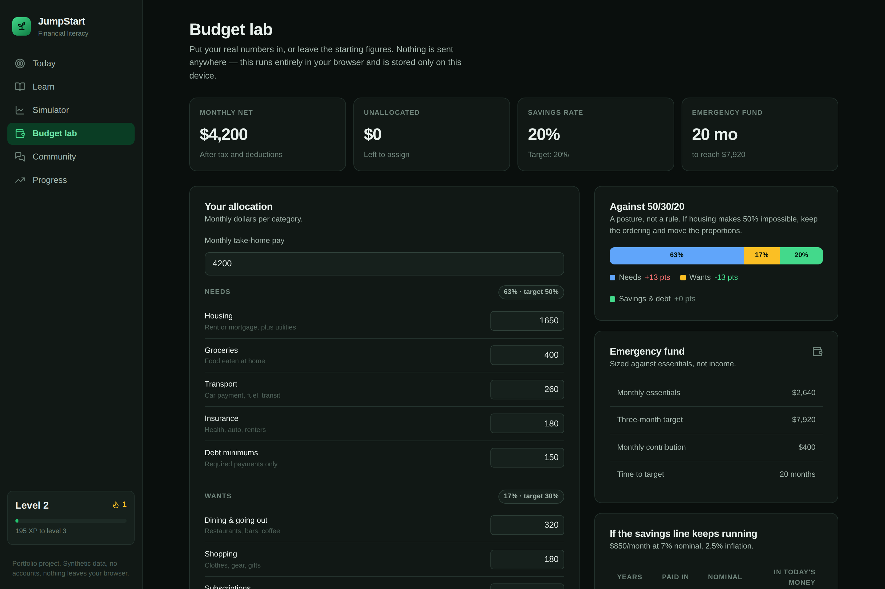
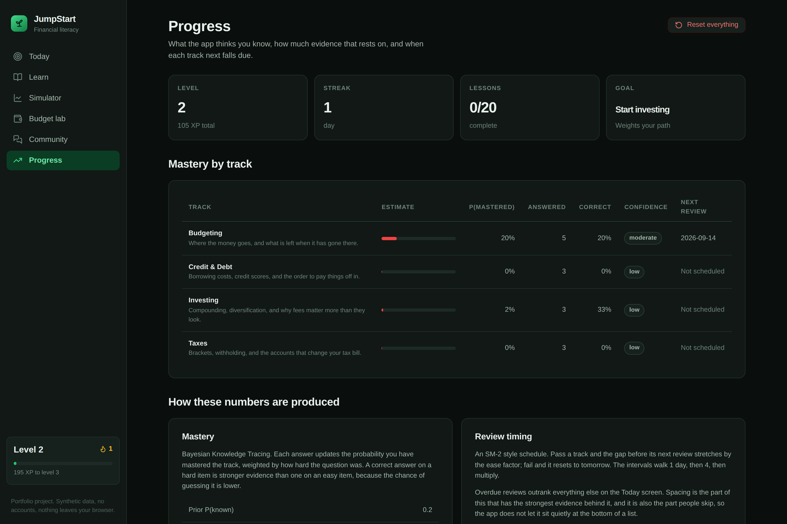

# JumpStart

**An adaptive financial-literacy app.** Bayesian mastery tracking, spaced repetition, a deterministic market simulator and a budget lab — as a working product, not a prototype.

[What it does](#what-it-does) · [The adaptive engine](#the-adaptive-engine) · [The market simulator](#the-market-simulator) · [Product decisions](#product-decisions) · [Running it](#running-it) · [Limitations](#limitations)

<!-- Add the live demo link here once the site is deployed. -->


---

## Background

JumpStart started as a student venture built in one month at the European Innovation Academy in Porto, where I was founder and product lead on a team of five. What we shipped there was a pitch deck, a Webflow landing page and a clickable Figma prototype — the usual output of a one-month accelerator.

This repository is my own reconstruction of that product as software that actually runs. The parts the deck claimed as differentiators — personalised education, gamified progression, a market component — are implemented here rather than mocked. Where the original overreached, this build says so instead of faking it: the deck listed real-time market data as a feature, and this version ships a clearly-labelled simulator instead.

It is a personal portfolio project. No code, data or design from the original team's work is reused.

---

## What it does

**Placement.** Twelve calibrated questions across budgeting, credit, investing and taxes, spanning three difficulty levels per track. No answers are revealed as you go, which keeps the responses usable as measurement.

**An adaptive path.** Every lesson is scored and ranked, and the top recommendations show the reasoning that produced them — the mastery estimate, the prerequisite chain, the review clock. Twenty lessons sit in a prerequisite DAG, so index funds are gated behind compounding and diversification rather than ordered by a list index.

**Practice with visible consequences.** After each lesson's questions, the app shows the mastery estimate before and after, so it is obvious that two correct answers on hard items moved the number further than four on easy ones.

**A market simulator.** $10,000 of play money against eight invented instruments with a shared market factor. Build a concentrated portfolio, step the clock forward a quarter, and watch the volatility the diversification lesson described actually turn up in the balance.

**A budget lab.** Allocation against 50/30/20, emergency-fund runway sized from essentials, and a savings projection shown in both nominal and inflation-adjusted dollars.

| | |
|---|---|
|  |  |
| Placement results, with every missed question explained | The simulator flagging a portfolio that is 100% one sector |
|  |  |
| Budget lab, recalculating live | The app explaining its own model |

---

## The adaptive engine

### Mastery: Bayesian Knowledge Tracing

The app tracks *P(this learner has mastered this skill)* rather than percent-correct, using BKT — the standard model in intelligent tutoring systems (Corbett & Anderson, 1995).

```
correct:   P' = P(1−slip) / [ P(1−slip) + (1−P)·guess ]
incorrect: P' = P·slip     / [ P·slip     + (1−P)(1−guess) ]
then:      P  = P' + (1−P')·transit
```

Percent-correct treats the tenth answer like the first and cannot tell a lucky guess on an easy item from a real answer on a hard one. BKT separates the observation from the latent skill, which is the distinction the path needs in order to rank anything.

**Difficulty modulates slip and guess.** A hard item is easier to slip on and harder to guess, so a correct answer on it moves the estimate further. This is why placement can be twelve questions instead of forty. Guess is floored near pure chance — with four options, claiming a guess rate far below 0.25 would overstate what a correct answer proves.

**The learning term is switched off during placement.** This is the one real departure from textbook BKT, and it came out of a failing test. With `transit` fixed at 0.18, three consecutive wrong answers still left the estimate near its 0.2 prior, because the model kept assuming the learner was picking it up as they went. That is correct during practice, where an explanation follows every question. It is wrong during a diagnostic, where nothing is taught — and a diagnostic that cannot report low mastery is not a diagnostic. So `transit` is a parameter: zero for placement, standard for practice.

A pleasant consequence is that placement updates become pure Bayes and therefore commute, so shuffling the question order cannot change where a learner lands. Practice deliberately does not have that property. Both are asserted in `src/state/reducer.test.ts`.

**Confidence is reported separately.** BKT gives a probability, not an error bar. Rather than invent one, the app reports evidence volume on a saturating curve and labels it low / moderate / high, so a 62% estimate from three answers is not presented as identical to a 62% estimate from twenty.

### Scheduling: SM-2 with a prerequisite gate

Review intervals walk 1 day → 4 days → previous × ease, with the ease factor floored at 1.3. A session below 60% resets the interval to tomorrow: a skill you just failed is not a skill to revisit in three weeks.

Ranking combines four contributions, in descending priority:

| Contribution | Weight | Why |
|---|---|---|
| Overdue review | up to 90 | Spacing has the strongest evidence behind it and is the thing people skip |
| Foundation | up to 25 | Scaled by how many lessons it transitively unblocks |
| Goal alignment | up to 20 | The track the learner said they cared about |
| Room to improve | up to 30 | Scaled by `1 − P(mastered)` |

Lessons with unmet prerequisites are **excluded**, not down-weighted. Serving capital gains to somebody who has not met compounding produces a bad first experience that no amount of ranking finesse recovers.

### Why the reasoning is on screen

Every adaptive learning product claims personalisation. Showing the mastery estimate, the prerequisite chain and the review clock that produced the ordering is what makes the claim checkable. It also gives a learner who disagrees with a recommendation some way to tell whether the system is wrong or they are — which, in a product whose whole premise is that it knows what you do not know, seemed like the minimum.

---

## The market simulator

Prices follow geometric Brownian motion:

```
S(t+1) = S(t) · exp( (μ − σ²/2)·dt + σ·√dt·Z )
```

The `−σ²/2` correction keeps expected value equal to `S₀·e^(μt)`. Without it, higher volatility silently raises expected returns — exactly backwards, and precisely the wrong lesson for this app to teach by accident.

Each instrument carries a **market beta**, so one common factor moves everything and leaves an idiosyncratic remainder. That correlation structure is the point: a learner who buys NOVA and QNTL — both high-beta technology names — sees a portfolio that swings harder than one spread across sectors and bonds, because it genuinely does. The diversification lesson stops being an assertion.

Everything is seeded (`MARKET_SEED = 20240701`), so every learner sees the same market and the figures quoted here are reproducible. Per-instrument streams are keyed off the ticker rather than list position, so adding or removing an instrument does not shift the others' paths.

**No real market data is used anywhere.** The tickers are invented, and the app says so on the simulator screen, in the header and beside the prices. Shipping fake "live" quotes in a finance-education product would be the one genuinely indefensible shortcut available here.

---

## Product decisions

**No backend, no accounts.** State lives in `localStorage`. This is a real limitation — progress does not follow you to another device — and it is the right trade for a portfolio piece: there is no authentication to get wrong, no personal financial data held anywhere, and the app is a static bundle that costs nothing to run. The budget lab in particular asks for income and spending, and the honest answer to "where does this go" is "nowhere".

**Gamification tied to evidence of learning.** XP is awarded for reading, passing practice and keeping a review schedule — never for opening the app. A points system that rewards presence rather than progress inflates the number a learner is using to judge themselves, which in a financial-literacy product is worse than having no number.

**Levels on a quadratic curve** (`50·n·(n−1)`). Early levels arrive quickly; later ones take real work; the number still means something after a fortnight.

**The community is labelled fiction.** Seeded threads are written content with invented authors, disclosed at the top of the page. Replies you write stay on your device.

**One theme, executed precisely**, rather than two executed approximately. Green is reserved for exactly four meanings — primary action, active nav, gain, mastered — so it keeps carrying information.

**Content is education, not advice.** No products named, no rates that go stale, nothing jurisdiction-specific beyond US federal basics. Stated in the app, not only here.

---

## Architecture

```
src/
├── lib/
│   ├── rng.ts          mulberry32 + Box-Muller. Every synthetic number starts here
│   ├── mastery.ts      BKT update, confidence, SM-2 scheduling
│   ├── scheduler.ts    ranking, prerequisite gating, the "why this" reasons
│   ├── curriculum.ts   20 lessons, prerequisite DAG, goal weights
│   ├── items.ts        44 questions: 12 placement, 32 practice
│   ├── market.ts       GBM with a shared market factor, seeded
│   ├── portfolio.ts    VWAC cost basis, concentration, feedback
│   ├── budget.ts       50/30/20, runway, annuity projection
│   └── storage.ts      versioned localStorage codec, defensive on every read
├── state/
│   ├── reducer.ts      every transition, pure, `now` injected
│   └── useJumpStart.ts the one stateful hook
└── components/         presentational; no business logic
```

The rule that keeps it navigable: **`lib/` is pure TypeScript with no React import**. Every piece of interesting behaviour is testable without mounting anything, which is why there are 113 tests and no test renderer.

`now` is threaded through every dated action as a parameter rather than read from the clock inside, which is what lets the streak and spaced-repetition tests assert on specific dates.

---

## Running it

```bash
npm install
npm run dev        # http://localhost:5173
```

```bash
npm test           # 113 tests
npm run typecheck  # strict, with noUncheckedIndexedAccess
npm run lint
npm run build      # static bundle in dist/
```

Screenshots in `docs/screens/` are generated against the production build:

```bash
npm run build && npm run preview
node scripts/shoot.mjs
```

That script also fails on any console error, so it doubles as a smoke test of every screen.

**Deploying.** The build is fully static. `netlify.toml` sets the build command, publish directory, SPA redirect and security headers. Any static host works.

**Environment.** There are none. `.env.example` exists to document that the app takes no configuration and holds no secrets.

---

## Testing

113 tests, all on the logic rather than the markup:

- **mastery** — difficulty modulation in both directions, recovery after a wrong answer, bounds under 200 identical answers, convergence from a wildly wrong prior, SM-2 interval walk, the 1.3 ease floor
- **scheduler** — the graph is acyclic and every edge resolves, every track has an entry point, prerequisites gate correctly, overdue reviews outrank new material, foundations outrank leaves
- **market** — determinism across runs, per-instrument path independence, no non-positive prices, realised volatility ordering matches declared parameters
- **portfolio** — volume-weighted cost basis across purchases at different prices, cost basis unchanged by a partial sale, value conserved on a round trip, no mutation of input state
- **budget** — annuity formula against closed form, the early-versus-late compounding claim the lesson makes, zero-income and over-commitment edge cases
- **reducer** — order independence during placement, order dependence during practice, XP awarded exactly once, day clamping, empty and unknown-id submissions

Three bugs were caught this way and are worth naming, since they are the reason for the tests:

1. **The diagnostic could not report low mastery.** Described above. A modelling error, not a typo.
2. **Finished lessons reappeared forever.** A skill with no review scheduled has `dueAt === null`, which `daysOverdue` returned `0` for — reading as "due today". Completed lessons stayed pinned to the top of the list.
3. **A test asserting the wrong property.** I had asserted that placement updates were order-*dependent*. They are not, and should not be. The test was wrong and the behaviour was right.

---

## Limitations

Written out because a portfolio project that lists only its strengths is not telling you much.

- **Item difficulties are hand-assigned.** A real deployment would fit them from response data (IRT, or at minimum p-values per item). Twelve hand-tuned difficulties are enough to demonstrate the mechanism and not enough to be a calibrated instrument.
- **BKT parameters are not fitted.** `pInit`, `pTransit`, slip and guess are literature-typical defaults, not estimates from this population. With real usage they would be fitted per skill, which is where most of the accuracy would come from.
- **Mastery is tracked per track, not per concept.** Four skills is coarse. Real systems track dozens of knowledge components, which is what allows a review to target the specific thing you forgot rather than the whole track.
- **Progress is device-local.** No accounts means no sync. Clearing site data clears progress.
- **The market has no macro regimes.** GBM with constant drift and volatility produces no crashes, no volatility clustering and no fat tails. It is right for teaching diversification and wrong for teaching what a drawdown feels like.
- **The community is not a community.** Seeded content with no other users, labelled as such.
- **Content is US-centric and shallow by design.** Twenty lessons is an argument for a curriculum, not a curriculum.
- **No automated accessibility audit in CI.** Keyboard operability, focus management, skip link, labelled controls and reduced-motion support are implemented and manually verified; an axe pass in CI is the obvious next step.

---

## Licence

MIT — see [LICENSE](LICENSE).

Built by [Harlie Katz](https://harliekatz.netlify.app). All financial figures, prices, community posts and learner data in this app are synthetic. Nothing here is financial advice.
