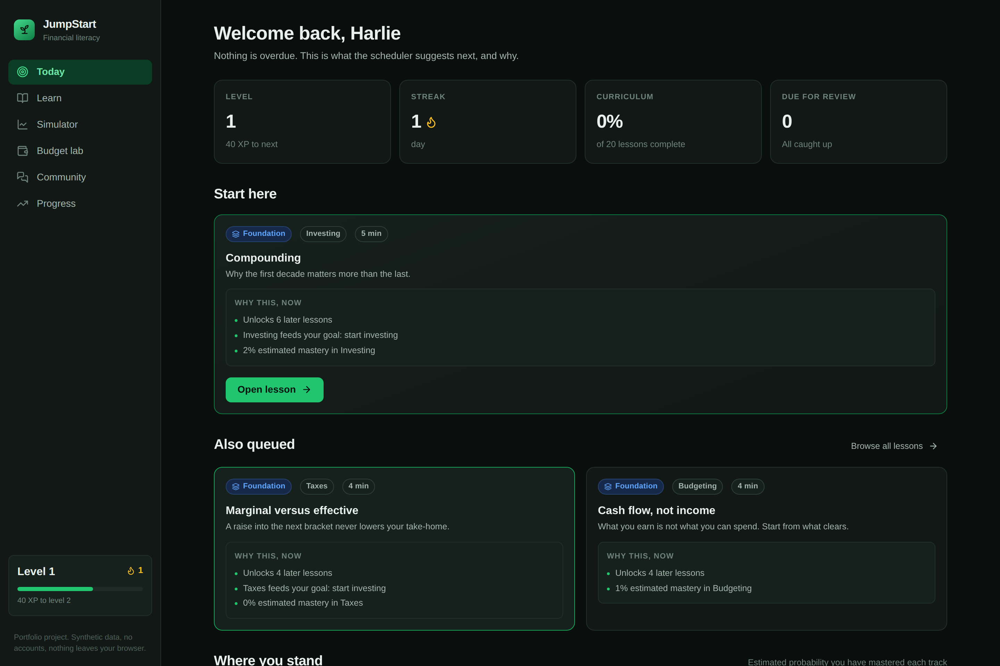
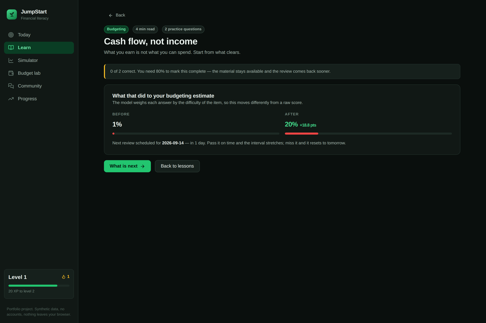

# JumpStart

A financial literacy app that places a learner with a short test, then builds a lesson path around what they already know and shows why each lesson was chosen.

**Demo.** [jumpstartfinance.netlify.app](https://jumpstartfinance.netlify.app)



## What a learner does

**Takes a twelve question placement test.** Three questions each across budgeting, credit, investing and taxes, spanning easy to hard. Nothing is revealed between questions, so the answers stay a measurement. At the end the app shows where the learner landed in each track and explains every question they missed.

**Works through a path that reorders itself.** Twenty lessons sit in a prerequisite graph, so index funds stay locked until compounding and diversification are done. Each lesson is a short reading followed by practice questions. After practice the app shows the mastery estimate before and after, so the learner can see that two right answers on hard questions moved the number further than four on easy ones.



**Practices with two simulators.** A market simulator gives $10,000 of play money against eight invented instruments that share a common market factor, so a portfolio concentrated in one sector genuinely swings harder. A budget lab compares an allocation against 50/30/20, sizes an emergency fund from essential spending, and projects a savings line in both nominal and inflation adjusted dollars.

## Why the app recommends what it does

Each available lesson gets a score, and the reasons that produced it are shown on the card. The score is a weighted sum rather than a priority order, so several weaker signals can outrank one strong one.

Take a learner who scored well on investing and badly on credit. Compounding unblocks six later lessons, which is the largest foundation signal in the curriculum. Credit scores unblocks one. Compounding still loses, because the room to improve term is worth up to 30 points and credit is the weaker track. The card says so, listing the mastery estimate alongside the unlock count, so the ordering is legible rather than mysterious.

Only an overdue review is decisive on its own. It is worth up to 90 points and the other five terms together reach at most 84.2. [Ranking and models](docs/models.md) gives the full term list.

## Background

JumpStart began as a student venture at the European Innovation Academy in Porto, where I was one of five founders and led product. What that team produced in a month was a pitch, a landing page and a clickable prototype.

This repository is my own build of the same idea as working software, written from scratch afterward. No code, design or data from the team's work is reused here. Where the original pitch claimed real time market data, this version ships a clearly labeled simulator instead.

## Run it locally

```bash
npm install
npm run dev        # http://localhost:5173
```

```bash
npm test           # 115 tests
npm run typecheck
npm run lint
npm run build      # static bundle in dist/
```

No environment variables are needed. There is no backend and no account.

## Implementation notes

- [Architecture](docs/architecture.md) covers the state model and how the app is laid out.
- [Ranking and models](docs/models.md) covers the recommendation score, Bayesian knowledge tracing, the evidence label and the review schedule.
- [Testing](docs/testing.md) lists what the suite covers and what it does not.
- [Limitations](docs/limitations.md) covers unfitted parameters, local storage and the simulated market.

## License

MIT, see [LICENSE](LICENSE). Built by [Harlie Katz](https://harliekatz.netlify.app). All figures, prices, community posts and learner data in this app are synthetic.
